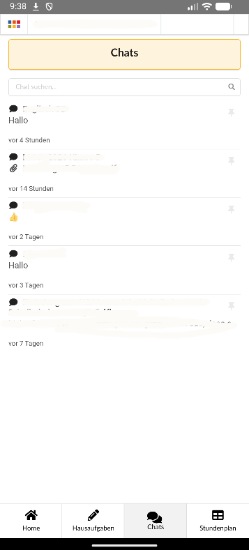

# SchoolChatMonitor

Eine Android-App für das [Schülerportal](https://schueler.schule-infoportal.de/), mit der das Portal bequem genutzt werden kann, ohne dafür jedes Mal einen Webbrowser öffnen zu müssen.

## Funktionen

- Zugriff auf das Schülerportal direkt über die Android-App
- Login Cookie wird persistent gespeichert
- Benachrichtigungen bei neuen Chatnachrichten
- Regelmäßige Überprüfung auf neue Nachrichten
- Funktioniert im Hintergrund, solange Android die App nicht durch Energiesparmaßnahmen beendet

## ⚡ Wichtig: Energiesparmaßnahmen deaktivieren

Damit die App regelmäßig nach neuen Nachrichten suchen und Benachrichtigungen anzeigen kann, darf Android sie nicht durch Energiesparmaßnahmen bzw. Akku-Optimierung beenden.

Da sich die Einstellungen je nach Hersteller und Android-Version unterscheiden, findest du hier Anleitungen für verschiedene Geräte:

**[👉 dontkillmyapp.com](https://dontkillmyapp.com/)**

Suche dort nach deinem Smartphone-Hersteller und folge den entsprechenden Anweisungen, um die Einschränkungen für die App zu reduzieren oder zu deaktivieren.

> **Hinweis:** Wenn Android die App im Hintergrund beendet, kann die regelmäßige Überprüfung auf neue Nachrichten nicht stattfinden. In diesem Fall können Benachrichtigungen verspätet oder gar nicht angezeigt werden.
